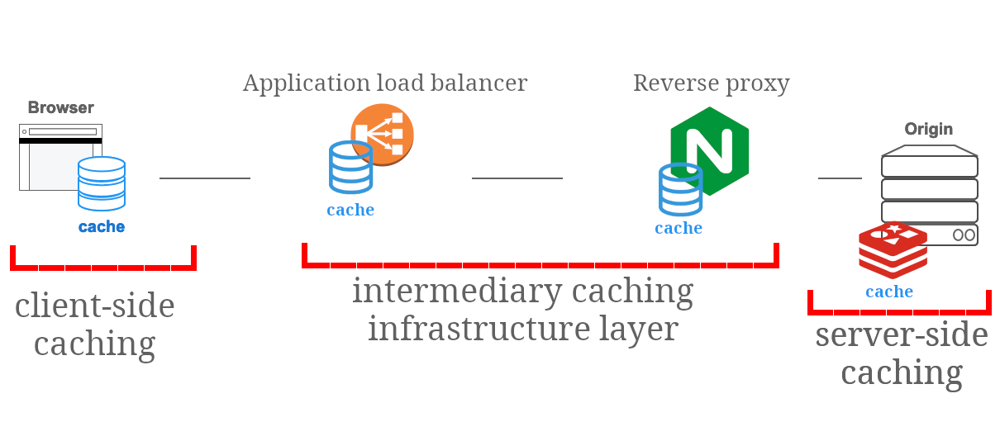
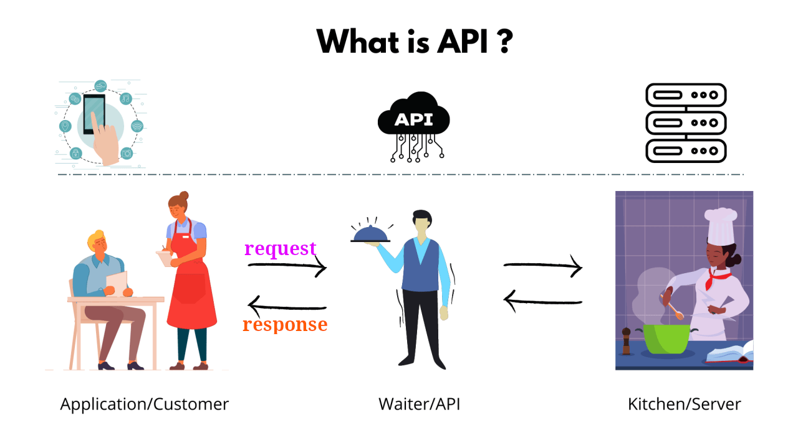
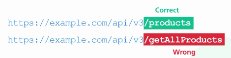
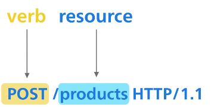
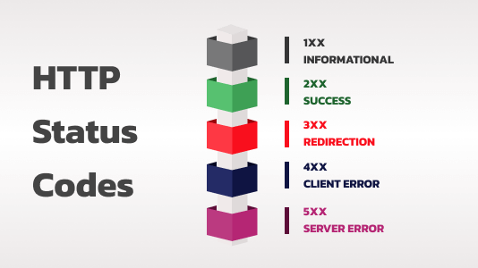

# RESTful APIs

- REpresentational State Transfer.
- Communication standard.
- Most common one used ATM<small>(At this moment)</small>.
- It's not specification. But an architectural style, and these are design principles of REST APIs:

  1. Starting with the Null Style.
  2. Client-Server.
  3. Stateless.
  4. Cache.
  5. Uniform Interface.
  6. Layered System.
  7. Code-On-Demand.
  8. Style Derivation Summary.

  <br />
  <details>
    <summary>
      Two Perspectives on Architectural Design (#1 explanation)
    </summary>
    <table>
      <caption>
        <strong>REST follows "Incremental Constraints Approach".</strong>
      </caption>
      <thead>
        <tr>
          <th></th>
          <th>
            Starting from Scratch <small>(Blank Slate Approach)</small>
          </th>
          <th>
            Starting with Needs and Adding Constraints
            <small>(Incremental Constraints Approach)</small>
          </th>
        </tr>
      </thead>
      <tbody>
        <tr>
          <td>Description</td>
          <td>
            Designer begins with <em>no</em> preconceived constraints
            <small>(predetermined rules or limitations)</small> or guidelines.
            <br />
            They start with a blank canvas, creating an architecture by gradually
            adding familiar components until the system meets its intended requirements.
          </td>
          <td>
            Designer starts by considering the overall needs of the system
            without any constraints. They then gradually impose constraints
            on different parts of the system. 
            <br />
            These constraints help ensure that various factors
            <small>(E.g. efficiency, usability, or scalability)</small>
            influencing the system, are addressed naturally.
          </td>
        </tr>
        <tr>
          <td>Characteristics</td>
          <td>
            Emphasizes creativity and an unrestricted vision, allowing the
            designer to explore many possibilities without initial
            limitations.
          </td>
          <td>
            Focuses on understanding the system's context and purpose,
            applying restraint to align the design with the real-world
            influences/conditions.
          </td>
        </tr>
      </tbody>
    </table>
  </details>

  <details>
    <summary>
      Client-Server constraints.
    </summary>
    <ul>
      <li>
        Separation of concerns is the principle behind the client-server constraints.
      </li>
      <li>
        Separate UI concerns from the data storage concerns.
      </li>
      <li>
        More portable UI across multiple platforms.
      </li>
      <li>
        Better scalability by simplifying the server components.
      </li>
      <li>
        Components can evolve independently.
      </li>
    </ul>
  </details>

  <details>
    <summary>
      Stateless communication constraints.
    </summary>
    <p>
      Each request from client to server must contain all of the information necessary to understand the request. Session state is therefore kept entirely on the client.
    </p>
    <table>
      <thead>
        <tr>
          <th>Pros</th>
          <th>Cons</th>
        </tr>
      </thead>
      <tbody>
        <tr>
          <td>
            <ul>
              <li>
                Improved visibility: monitoring system does not have to look beyond a single request 
                <a href="../glossary/README.md#datum">datum</a>
                in order to determine the full nature of the request.
              </li>
              <li>
                More reliable because it eases the task of recovering from
                <a href="../glossary/README.md#partialFailures">partial failures</a>.
                <br />
                Remember, each request is completely self-contained and independent of previous requests,
                in case of failure client can simply retry
                <small>(The concept of idempotency is closely related to the idea of statelessness)</small> it.
              </li>
              <li>
                Improved scalability: not having to store state between requests allows the server component to quickly free resources.
              </li>
              <li>
                Simplified implementation: server doesn't have to manage resource usage across requests.
              </li>
            </ul>
          </td>
          <td>
            <ul>
              <li>
                Decreased network performance: by increasing the repetitive data <small>(per-interaction overhead)</small> sent in a series of requests.
              </li>
              <li>
                Reduced server control over consistent application behavior<small>(UI/UX)</small>: 
                application becomes dependent on the correct implementation of semantics across multiple client versions.
                <br />
                E.g., a newer client version might handle certain data or state management differently than an older version, leading to varying user experiences or even errors.
              </li>
            </ul>
          </td>
        </tr>
      </tbody>
    </table>
  </details>

  <details>
    <summary>
      Cache constraints.
    </summary>
    <ul>
      <li>
        This is all about Client-Side Caching: not server-side caching or intermediary caching <small>(infrastructure layer)</small>.
        <br />
        
      </li>
      <li>
        The data within a response to a request, implicitly/explicitly is labeled as cacheable or non-cacheable. A cacheable response signifies that a client cache can reuse that response data for later, equivalent requests.
      </li>
    </ul>
  </details>

  <details>
    <summary>
      Uniform Interface constraints
    </summary>
    <ul>
      <li>
        We will have consistent set of operations and conventions
        <small>(HTTP spec)</small> for interactions between clients and servers.
      </li>
      <li>
        This is also well aligned with generality and simplification principle.
      </li>
    </ul>
  </details>

  <details>
    <summary>
      Layered System constraints
    </summary>
    <ul>
      <li>
        This style allows an architecture to be composed of hierarchical layers.
      </li>
      <li>
        Each component cannot "see" beyond the immediate layer with which they are interacting.
      </li>
      <li>
        Adds Overhead and latency to the processing of data which can be offset by utilizing caching mechanisms.
      </li>
    </ul>
  </details>

  <details>
    <summary>
      Code-On-Demand constraints.
    </summary>
    <ul>
      <li>
        Server can send executable code to a client, allowing the client to run this code to extend its functionality.
      </li>
      <li>
        Reduces Visibility: When a client dynamically downloads and executes code, it can be harder to predict and monitor the exact behavior of the client application
      </li>
      <li>
        E.g. a dynamic form or a real-time chat widget.
      </li>
    </ul>
  </details>

  <details>
    <summary>
      Style Derivation Summary.
    </summary>
    <p>
      The constraints of REST are not random; they are derived from well-established architectural styles.
    </p>
  </details>

- Not all APIs are RESTful APIs, learn more [here](https://roy.gbiv.com/untangled/2008/rest-apis-must-be-hypertext-driven). But those who are following REST constraints are called RESTful API.

## API

- Application Programming Interface.
- A way for two computers to talk to each other.



## Basics of a RESTful API

- Resources:

  - Grouped by noun <small>(Not verb)</small>.

    

- Different HTTP verbs should be utilized for different purposes:

  - [GET](https://datatracker.ietf.org/doc/html/rfc7231#section-4.3.1): Fetching data.
  - [Post](https://datatracker.ietf.org/doc/html/rfc7231#section-4.3.3): What the server will do with the data in the request body <em>depends<em> on what the server is set up to do with it. <strong>Different endpoints or resources</strong>, on the server, <strong>might handle the data in different ways</strong> based on their own specific logic or rules.
  - [PATCH](https://datatracker.ietf.org/doc/html/rfc5789): Partially update the resource, rather than replacing the whole thing.
  - [PUT](https://datatracker.ietf.org/doc/html/rfc7231#section-4.3.4): Create or replace the resource.
  - [DELETE](https://datatracker.ietf.org/doc/html/rfc7231#section-4.3.5): Remove the resource specified in the URI.

  

- HTTP status codes:

  

- [Idempotent](../glossary/README.md#idempotency):

  - When an endpoint is idempotent we **can** retry the request if it failed with 500.
  - We say **can** since all HTTP verbs ain't idempotent. E.g. `POST` ain't idempotent.

- Versioning:

  - APIs only need to be up-versioned when a breaking change is made. Breaking changes include:
    - A change in the format of the response data for one or more calls.
    - A change in the request or response type (i.e. changing an integer to a float).
    - Removing any part of the API.
  - The version do not need be numeric, nor specified using the `vX` syntax. E.g. you can use these as your version too:
    - Dates.
    - Project names.
    - Seasons.
  - 2 common approaches to versioning:

    1. URI Versioning:

       - E.g. prefixing the resource with `v1`.

       ```cmd
       http://api.example.com/v1/vehicles
       http://apiv1.example.com/vehicles
       ```

    2. Custom Request Header:

       - E.g. `Accept-version`

       ```cmd
       Accept-version: v1
       Accept-version: v2
       ```

# Refs

- [What Is REST API? Examples And How To Use It: Crash Course System Design #3](https://www.youtube.com/watch?v=-mN3VyJuCjM)
- [Representational State Transfer (REST)](https://ics.uci.edu/~fielding/pubs/dissertation/rest_arch_style.htm)

# Learn more

- [My LinkedIn post](https://www.linkedin.com/posts/kasir-barati_http-spec-rfc-activity-7224516416043929600-33_H?utm_source=share&utm_medium=member_desktop)
