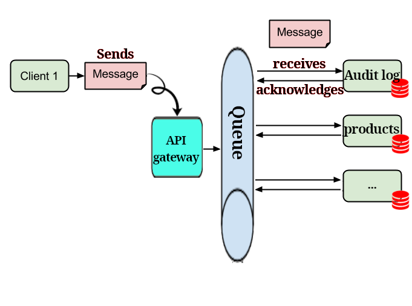
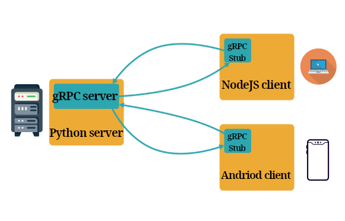
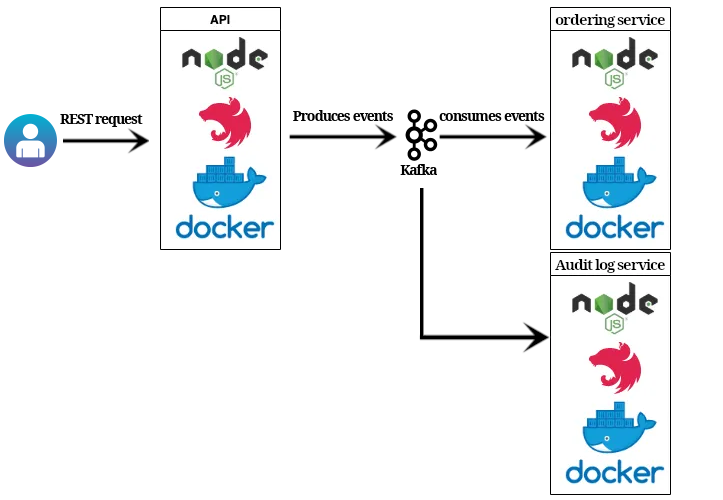
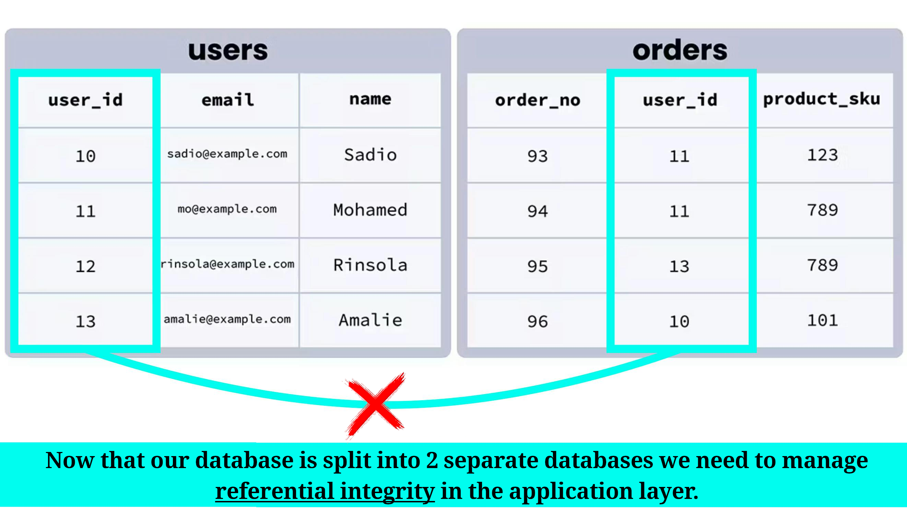
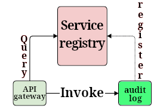
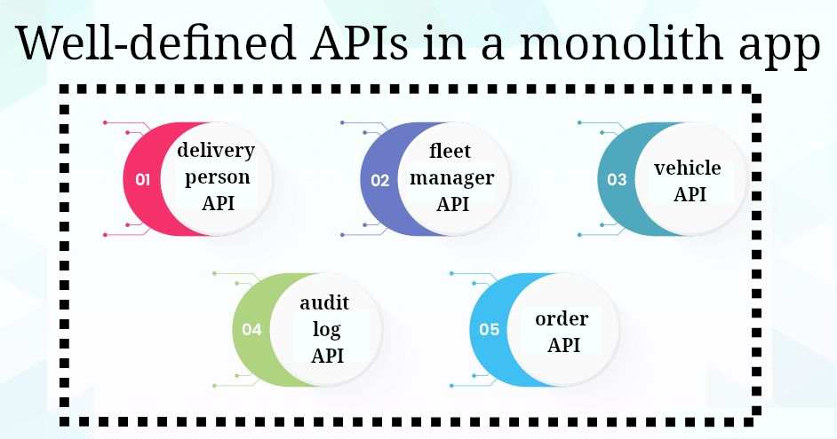
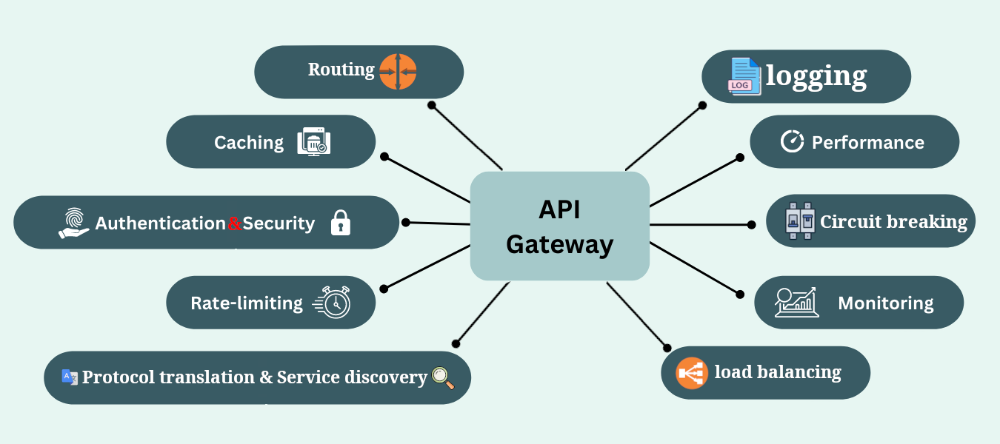

# Microservices

1. A software development architecture.
2. Enables **large** teams to build scalable applications.
3. Each application is composed of multiple loosely coupled services.
4. Each service handles a dedicated task/function inside a large app.
5. Each function/task is called a domain.
6. They have small surface areas (APIs) .
   - This makes it easier to reason about each system in the context of entire app.
7. Microservices talk to one another over

   |                | Event streaming | Remote Procedural Call (RPC) | Message brokers |
   | -------------- | --------------- | ---------------------------- | --------------- |
   | Latency        | Moderate        | Fast                         | Slower          |
   | Fault tolerant | High            | Moderate                     | High            |
   | Isolation      | High            | Moderate                     | High            |

   

     

       Inter-service Communication Technologies.
     

     <table>
       <thead>
         <tr>
           <th></th>
           <th>Name</th>
           <th>Infographic</th>
         </tr>
       </thead>
       <tbody>
         <tr>
           <td 
             style="text-decoration: underline dotted; text-underline-offset: 0.1em; cursor: help;"
             title="Message Queue"
           >
             Message Broker
           </td>
           <td>RabbitMQ</td>
           <td></td>
         </tr>
         <tr>
           <td>RPC Framework</td>
           <td>gRPC</td>
           <td></td>
         </tr>
         <tr>
           <th
             style="text-decoration: underline dotted; text-underline-offset: 0.1em; cursor: help;"
             title="Distributed Streaming Platform"
           >
             Event Streaming Platform
           </th>
           <td
             style="text-decoration: underline dotted; text-underline-offset: 0.1em; cursor: help;"
             title="Apache Kafka"
           >
             Kafka
           </td>
           <td></td>
         </tr>
       </tbody>
     </table>
   

   

     

       Learn more about latency.
     

     <table>
       <thead>
         <tr>
           <th>Event streaming platforms</th>
           <th>RPC</th>
           <th>Message brokers</th>
         </tr>
       </thead>
       <tbody>
         <tr>
           <td>
             Optimized for high-throughput and scalable processing of event data. While they can provide near real-time processing, the speed can vary depending on factors like:
             <ul>
               <li>Network latency.</li>
               <li>Volume of events.</li>
               <li>Architecture of the consuming services.</li>
             </ul>
           </td>
           <td>
             Typically the fastest option in terms of latency because:
             <ul>
               <li>It is synchronous.</li>
               <li>It often involves direct communication between services.</li>
             </ul>
             It is designed for request-response interactions, which means that the calling service waits for a response from the callee.
           </td>
           <td>
             Generally slower than RPC because they involve more overhead. Messages are placed into queues and then processed, which introduces latency, especially if the system needs to:
             <ul>
               <li>Handle complex routing.</li>
               <li>Message durability.</li>
               <li>Large numbers of consumers.</li>
             </ul>
           </td>
         </tr>
       </tbody>
     </table>
   

   

     

       Learn more about fault-tolerance.
     

     <table>
       <thead>
         <tr>
           <th>Event streaming platforms</th>
           <th>RPC</th>
           <th>Message brokers</th>
         </tr>
       </thead>
       <tbody>
         <tr>
           <td>
             Designed with fault tolerance in mind. They offer features like:
             <ul>
               <li>
                 
                   Data replication:
                 
                 ensures that data is not lost if a node fails.
               </li>
               <li>Partitioning: enhances both fault-tolerance and scalability.</li>
               <li>replaying events, which can be beneficial for system recovery or auditing purposes.</li>
               <li>
                 Being able to maintain the order of events, which is crucial for certain use cases.
               </li>
             </ul>
           </td>
           <td>
             Limited built-in fault-tolerance. 
             Since RPC involves direct communication between services, failures in each one the following can lead to
             
               errors or timeouts:
             
             <ul>
               <li>The network.</li>
               <li>The service being called.</li>
               <li>The caller.</li>
             </ul>
             Fault-tolerance can be enhanced by implementing:
             <ul>
               <li>Retry mechanisms.</li>
               <li>Circuit breakers.</li>
               <li>Fallback strategies</li>
             </ul>
           </td>
           <td>
             Often more fault-tolerant because they decouple the sender and receiver. They can provide features such as:
             <ul>
               <li>
                 Message persistence.
               </li>
               <li>
                 delivery guarantees <small>(at least once, at most once, or exactly once)</small>.
               </li>
               <li>
                 dead-letter queues <small>(DLQ)</small> to handle failed message deliveries.
               </li>
             </ul>
            These characteristics makes it suitable for systems requiring high-availability and resilience to service interruptions.
           </td>
         </tr>
       </tbody>
     </table>
   

   

     

       Learn more about isolation and decoupling.
     

     <table>
       <thead>
         <tr>
           <th>Message Broker</th>
           <th>RPC Framework</th>
           <th>Event Streaming Platform</th>
         </tr>
       </thead>
       <tbody>
         <tr>
           <td>
             Services communicate asynchronously and abstractly through queues/topics, meaning that if one service:
             <ul>
               <li>Fails.</li>
               <li>Slowdown.</li>
               <li
                 style="text-decoration: underline dotted; text-underline-offset: 0.1em; cursor: help;"
                 title="Assuming that it won't change its message format."
               >
                 Evolve.
               </li>
             </ul>
             It does not directly impact others. Messages can be buffered until the receiving service is available again.
           </td>
           <td>
             Less isolation compared to other methods. Since services communicate synchronously and directly, things like:
             <ul>
               <li>Downtime.</li>
               <li>Slow performance.</li>
               <li>Failures in one service.</li>
               <li>Changes in the interface or the location.</li>
             </ul>
             of one service can propagate and impact other services. This is happening because of
             
               tight coupling between services
             .
           </td>
           <td>
             Producers and consumers of events operate independently, and the system can handle large volumes of events even if some services are temporarily unavailable. In this communication method we support:
             <ol>
               <li>real-time processing</li>
               <li>replay events</li>
             </ol>
             Which can be useful for data recovery and analytics.
           </td>
         </tr>
       </tbody>
     </table>
   

8. You can deploy faster since each service is independent of others.
9. You can scale each service horizontally and vertically.
10. Well microservices architecture practice strong information hiding: meaning that each service's database schema is not exposed to the other services.
11. One of the implementation difficulties in a microservices architecture is that:
    
12. API gateway plays a key role in this architecture.

    - We'll handle our auth flow with an OAuth server.
    - For routing to different services we'll need to have a service registry and discovery.

      

## Should you go for a microservice architecture?

- It is very budget-intensive.
- It needs a large team.

> [!TIP]
>
> Recommendation: if your team is a small team with limited budget it is better to have a monolith application with well defined APIs. So that it would be easier to refactor it later to a microservice arch.
>
> 

## API gateway

- A single point of entry to the clients of an application.
- It abstracts the complexity of the underlying microservices architecture, presenting a unified interface.
- [See how a requests flows in each part of API gateway](https://youtu.be/6ULyxuHKxg8?t=50).

By having an API gateway client interactions with the microservices architecture will be much simpler, security and scalability improves, and we can centrally managing traffics and apply policies.

| Functionality            | Description                                                                                                                                                                           |
| ------------------------ | ------------------------------------------------------------------------------------------------------------------------------------------------------------------------------------- |
| Routing                  | Directs client requests to the appropriate microservice                                                                                                                               |
| Load Balancing           | Distributes requests across multiple instances of a service to manage load and ensure availability.                                                                                   |
| Auth & Security          | Implements authentication & authorization mechanisms. Only authorized users can access the services.                                                                                  |
| Rate limit               | Controls the number of requests a client can make in a given time period.                                                                                                             |
| Monitoring & logging     | Tracks request & response metrics, to monitor the health and performance of the services.                                                                                             |
| Circuit breaking pattern | Detecting and handling failures gracefully in a distributed system ([Learn more](https://microservices.io/patterns/reliability/circuit-breaker.html)).                                |
| Service discovery        | Instead of clients, directly interacting with multiple microservices, they only communicate with the API gateway. The gateway then routes these requests to the appropriate services. |
| Protocol translation     | Each microservice receives requests using the needed protocol, yet the clients rely on just the single protocol they support best.                                                    |

### Validation

We can have our validations in two different places:

<table>
  <thead>
    <tr>
      <th></th>
      <th style="text-align: center">API gateway</th>
      <th style="text-align: center">Individual services</th>
    </tr>
  </thead>
  <tbody>
    <tr>
      <td>Pros</td>
      <td>
        <ul>
          <li>
            <b
              style="
                text-decoration: underline dotted;
                text-underline-offset: 0.1em;
                cursor: help;
              "
              title="Can be mitigated with things like having a monorepo, shared libs."
              >Consistency</b
            >: ensuring consistent enforcement of rules across all
            services. Particularly useful for cross-cutting concerns
            such as authentication, authorization, rate limiting, and
            general data format validation.
          </li>
          <li>
            <b>Security</b>: blocking potentially harmful requests
            before they reach the backend services, reducing the
            attack surface.
          </li>
          <li>
            <b>Simplification for Backend Services</b>
          </li>
          <li>
            <b>Ease of Management</b>: Centralizing common validation
            logic can make it easier to manage and update
            policies.
          </li>
        </ul>
      </td>
      <td>
        <ul>
          <li>
            <b>Domain-Specific Validation.</b>
          </li>
          <li>
            <b>Flexibility and Independence.</b>
          </li>
          <li>
            <b>Reduced Gateway Load.</b>
          </li>
        </ul>
      </td>
    </tr>
    <tr>
      <td>Cons</td>
      <td>
        <ul>
          <li
            style="
              text-decoration: underline dotted;
              text-underline-offset: 0.1em;
              cursor: help;
            "
            title="Can be mitigated with replication."
          >
            Single point of failure
          </li>
          <li>Coupling API gateway with other services.</li>
        </ul>
      </td>
      <td>
        <ul>
          <li>Duplicated validation logic across services.</li>
          <li>
            Inconsistent validation logic across multiple services.
          </li>
        </ul>
      </td>
    </tr>
  </tbody>
</table>

# Refs

1. [What Are Microservices Really All About? (And When Not To Use It)](https://www.youtube.com/watch?v=lTAcCNbJ7KE&t=22s)

# Footnotes
