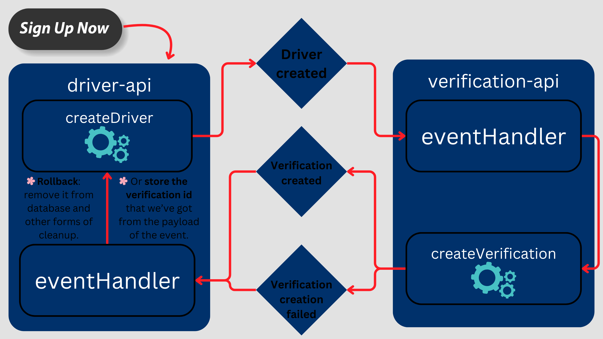

# Saga

- A design pattern.
- The answer to ACID when I have different services in my microservices architecture.
- Consistency of data across microservices in a distributed system.
  - Note that we cannot use 2PC (2 phase commit) since **EACH service has its own database instance**.
- A sequence of transactions that will send an event/message to the next step of the transaction, when the transaction is successful.

  But if one of them fail, saga also will send an event/message that informs a failure of a transaction to previous steps that took place.

## Different approaches to implement Saga

So we know that the first step of the sequence of transactions have been completed. Then next question naturally is what should I do next? As is what is the next transaction that I should create for this process to proceed.

Or what if one of the steps fail? How changes that have been applied to each microservice should be undone.

You could have some sort of branching model, for instance in an ECommerce app customer's order might get busted duo to insufficient credit or completes. We are just simplifying stuff here but as you can see there are 2 different paths out app can undergo.

### Choreography-based coordination

- Distributed decision making.
- Saga participants figure it out what should they do amongst themselves.
- Saga logic is scattered amongst different services. In other word **we're coupling things together** and as a result really messy: 

### Orchestration-Based coordination

- Centralized decision making.
  - One arranger manages all the transactions and directs services to execute local transactions.
- Here we have a central component called _Saga orchestrator_ that decides what's next.
- This centralized decision maker invokes APIs of other services.

There are two models for orchestrating Saga: implicit and explicit orchestrator

#### Implicit Saga orchestrator

- Use an existing domain model (service) to sorta orchestrate your Saga. Like in our [No Taxi, No Fun](https://github.com/kasir-barati/nestjs-materials/tree/main/microservices/no-taxi-no-fun) our `driver-api` service can kinda take over this position and orchestrate the entire thing.
- Plus side is that we're leveraging the existing codebase.
- Downside is that we are adding extra work for `driver-api` service or whoever is that service who's taking care of that for us.
- Actually I was trying to solve ACID issue on my own andd I kinda came up with the same idea. We have a software similar to Uber called [No Taxi, No Fun](https://github.com/kasir-barati/nestjs-materials/tree/main/microservices/no-taxi-no-fun):
  1. So our `driver-api` creates a new driver and emits an event saying that it created a new driver and put the ID inside the event payload.
  2. Then our `verification-api` consumes it and:
     - After creating a bare bone document for it publishes its message containing the verification id.
     - Or in case of failure for any reason it will emit an event stating that it failed to create the verification.
  3. Then in our `driver-api` we're gonna listen to them and change the driver resource state in our database.

- `driver-api` is interacting with other services directly but our `driver-api` is
  1. Overloaded with work and responsibilities.
  2. Cyclic dependencies that we've created in this approach.

#### Explicit Saga orchestrator

- A separate object (service) that its main duty is to handle Saga, which leads to better separation of concerns.
- But now we have one more service to manage, and develop.

> [!CATION]
>
> Each service has its own channel for sending and receiving messages.

> [!NOTE]
>
> Sending message and also inserting data into database should be transactional. We need to make sure that we have ACID property. Namely we need to have a transactional messaging mechanism on top of Saga. **This transactional messaging system makes our Saga implementation completely reliable**.

## 3 main components of Saga

| Local transactions                                        | Compensation Transactions                                                                                                                                                                                                                               | Communication                                                                                                                                                                                       |
| --------------------------------------------------------- | ------------------------------------------------------------------------------------------------------------------------------------------------------------------------------------------------------------------------------------------------------- | --------------------------------------------------------------------------------------------------------------------------------------------------------------------------------------------------- |
| Each step in each service is done in a local transaction. | If local transactions fails, compensating transactions are triggered for the current step and previous steps which were successful. These compensating transactions are essentially undo operations, ensuring the system returns to a consistent state. | Services communicate with each other through messages/events. Synchronous or, more commonly, asynchronous using message queues or event buses. The Saga Execution Controller triggers these events. |

## Npm packages

1. [@sebaseg/saga-builder-nestjs](https://www.npmjs.com/package/@sebaseg/saga-builder-nestjs).
2. [nestjs-saga](https://www.npmjs.com/package/nestjs-saga).
3. [nest-maestro](https://www.npmjs.com/package/nest-maestro).
