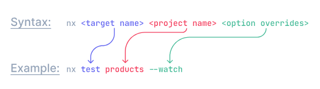
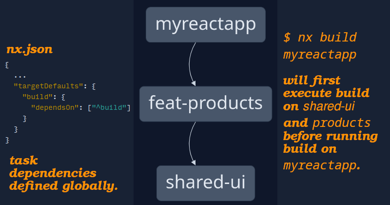
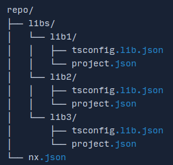
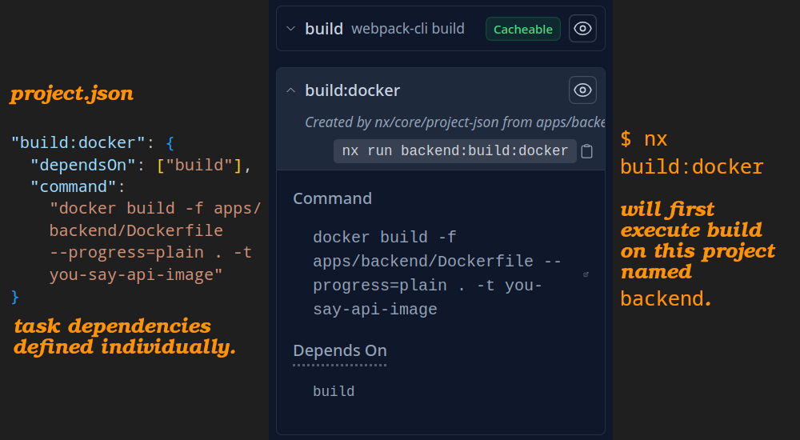

# What the heck is monorepo?

In [VCS](https://en.wikipedia.org/wiki/Version_control), a monorepo is:

- A software-development strategy.
- Where the code for a number of projects is stored in the same repository.

## What does Nx for me?

- A powerful open-source build system.
- Provides tools and techniques for:
  - Enhancing developer productivity.
  - [Optimizing CI performance](./CI.md).
  - Maintaining code quality.
- Run tasks in parallel based on the dependencies between them.
- Caches tasks.
- Works the same way with any JS or non-JS project.

### Create a workspace in Nx

- Workspace is a monorepo in which we are gonna have our codebase.
- `npx create-nx-workspace --pm pnpm`
  - Will ask you a bunch of question about what kind of workspace do you need.

### `Plugins`

- NPM packages.
- Build on top of the fundamental capabilities provided by the Nx.
- Contain code generators, executors (to abstract lower-level build tooling) and automated code migrations for keeping your tools up to date.
- Are usually technology specific.
- Increases productive by removing any friction of integrating different tools with each other and by providing utilities to keep them up to date.
- Use the `@nx/plugin` package to easily scaffold a new plugin or even just automate your local workspace.

### Devkit

- A set of utilities for building Nx [plugins](#plugins).

### [Tasks](https://nx.dev/features/run-tasks)



- Run multiple tasks: `npx nx --run-many targetName1 targetName2`
- <a href="#executorDefinitionInNx" id="executorDefinitionInNx">#</a> Each task has what we call it "executor": it is the tool or script used to run that target.
- Nx picks up tasks from:

  1. `package.json` scripts.
  2. Defined inside `project.json`.

  And their config:

  - It infer/deduce them from configuration files (e.g. `jest.config.ts`).

- Run tasks affected by your PR: `npx nx affected -t test`.



- <table>
    <caption>
      <strong>targetDefaults</strong>
      <dl>
        <dt>Here we assume Same Target Name, Same Executor.</dt>
        <dd>
          Multiple targets (tasks like <code>build</code>, <code>test</code>) with the same name across different projects, they all use the same executor.
        </dd>
      </dl>
      <p>What did we get out of this?</p>
      <ul>
        <li>DRY principle.</li>
        <li>Ease of maintenance and development.</li>
        <li>Easer time to reason about each project's configuration.</li>
      </ul>
    </caption>
    <thead>
      <tr>
        <th>Folder structure</th>
        <th>Before operation <code>libs/lib1/project.json</code></th>
        <th><code>nx.json</code></th>
        <th>After operation <code>libs/lib1/project.json</code></th>
      </tr>
    <thead>
    <tbody>
      <tr>
        <td></td>
        <td>
          https://github.com/kasir-barati/you-say/blob/182d7607249bd3371cf8f39e0290dccd94ecdbdd/.github/docs/monorepo/libs-lib1-project.json#L1-L40
        </td>
        <td>
          https://github.com/kasir-barati/you-say/blob/182d7607249bd3371cf8f39e0290dccd94ecdbdd/.github/docs/monorepo/root-nx-for-libs.json#L1-L35
        </td>
        <td>
          https://github.com/kasir-barati/you-say/blob/91a2759180482b5e961bc01555c09c02bea09c9d/.github/docs/monorepo/reduced-project.json#L1-L16
        </td>
      </tr>
    </tbody>
  </table>

  - Two `build` targets with different executors:

    Do **NOT** use `build` as key inside the `targetDefaults`. But instead use use executor name as key:

    <table>
      <thead>
        <tr>
          <th><code>nx.json</code></th>
          <th><code>project.json</code></th>
        </tr>
      </thead>
      <tbody>
        <tr>
          <td>
            https://github.com/kasir-barati/you-say/blob/0324448d5446cd2a7e8bd8736e8ea1a9ab07182d/.github/docs/monorepo/executor-as-key.js#L15-L33
          </td>
          <td>
            https://github.com/kasir-barati/you-say/blob/0324448d5446cd2a7e8bd8736e8ea1a9ab07182d/.github/docs/monorepo/executor-as-key.js#L2-L12
          </td>
        </tr>
      </tbody>
    </table>

  - If you have to make exceptions for most of the projects in your repository, then that setting probably should not be a default.



### Caching

- Battle-tested computation caching system.
- Code is never rebuilt twice.
- Can be don in either:

  | `libs/lib1/project.json`                                                                                                   | `nx.json`                                                                                                                    |
  | -------------------------------------------------------------------------------------------------------------------------- | ---------------------------------------------------------------------------------------------------------------------------- |
  | https://github.com/kasir-barati/you-say/blob/aea61a68e1d9898b29dd6cb519867582522e27e5/.github/docs/monorepo/cache.js#L2-L8 | https://github.com/kasir-barati/you-say/blob/aea61a68e1d9898b29dd6cb519867582522e27e5/.github/docs/monorepo/cache.js#L11-L17 |

- The operation that you wanna cache need to be pure, no side effect is allowed. E.g. you cannot cache your e2e tests since something might have changed on your backend.
- `inputs`: defines what gets included as part of the calculated hash (e.g. files, environment variables, etc.).

  Exclude all `*.md` files from the cache so that whenever we change the any markdown file, it does not invalidate the build cache.

  | `libs/lib1/project.json`                                                                                                    | `nx.json`                                                                                                                    |
  | --------------------------------------------------------------------------------------------------------------------------- | ---------------------------------------------------------------------------------------------------------------------------- |
  | https://github.com/kasir-barati/you-say/blob/5a15e2bd131f8bfbb79e022a8b08ae5b5c2dd62d/.github/docs/monorepo/cache.js#L9-L16 | https://github.com/kasir-barati/you-say/blob/5a15e2bd131f8bfbb79e022a8b08ae5b5c2dd62d/.github/docs/monorepo/cache.js#L26-L33 |

- `outputs`: defines where the result of a task is placed after task execution (e.g. where is our coverage report).

  Define output locations if they differ from the usual `dist` or `build` directory since Nx by default recognizes those.

> [!NOTE]
>
> Learn about what are `projectName`, and they other place holders in [glossary](./glossary.md#projectRootDefinitionInNx).

- Nx plugin automatically configure caching based on your configuration files and also the executor.

  

### Important notes about `Nx`

1. Make sure to install the `@nx/whatever` version that matches the version of `nx` in your repository. If the version numbers get out of sync, you can encounter some difficult to debug errors. You can [fix Nx version mismatches with this recipe](https://nx.dev/recipes/tips-n-tricks/keep-nx-versions-in-sync).
2. Nx plugins lift the burden of things like scaffolding a new app (e.g. NestJS, NextJS), testing, building, etc
3. You can use `nx graph` and `nx show projects` to see what is going on in your monorepo.

### Upgrade dependencies -- `nx migrate latest`

This command is **NOT** gonna upgrade your devDeps and deps to the latest version. It is only upgrading `nx` and its belongings. So we can use other approaches to upgrade our dependencies:

```cmd
npm outdated
npm update
```

But most of the times `npm update` will NOT do the trick. So in those cases we need to rely on tools such as [npm-check-updates](https://www.npmjs.com/package/npm-check-updates)

```cmd
npm install -g npm-check-updates
ncu
```

if do not need `migrations.json` (scenarios such as applying same migration in other branches) remove it.
