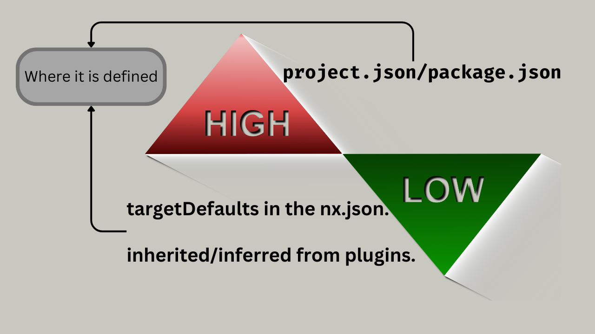

# Project Configuration



- See project detailed view in your browser: `nx show project my-huawei --web`
- Tasks that use executors must be defined in a `project.json`.
- Example `libs/mylib/project.json`:

  ```json
  {
    "root": "libs/mylib/",
    "targets": {
      "test": {
        "executor": "@nx/jest:jest",
        "options": {
          /* ... */
        }
      },
      "build": {
        "executor": "@nx/js:tsc",
        "options": {
          /* ... */
        }
      }
    }
  }
  ```

  ```shell
  $ nx build mylib
  $ nx test mylib
  ```

- Different settings:

  - Orchestration settings: how Nx runs tasks.

    ```json
    {
      "tags": ["scope:myteam"],
      "implicitDependencies": ["anotherlib"],
      "targets": {
        "test": {
          "dependsOn": ["build"]
        },
        "build": {
          "dependsOn": ["^build"]
        }
      }
    }
    ```

  - Execution settings: how the actual task is executed.

    ```json
    {
      "targets": {
        "test": {
          "executor": "@nx/jest:jest",
          "options": {}
        },
        "build": {
          "dependsOn": ["^build"],
          "executor": "@nx/js:tsc",
          "options": {}
        }
      }
    }
    ```

  - Caching settings: when Nx caches a task and what is actually cached.

    ```json
    {
      "namedInputs": {
        "default": ["{projectRoot}/**/*"],
        "production": ["!{projectRoot}/**/*.spec.tsx"]
      },
      "targets": {
        "test": {
          "inputs": ["default", "^production"],
          "outputs": []
        },
        "build": {
          "inputs": ["production", "^production"],
          "outputs": ["{workspaceRoot}/dist/libs/mylib"]
        }
      }
    }
    ```

## Task definitions/targets

```ts
{
  // defines a keyword, thus when you're using default or production Nx knows which files do you mean.
  "namedInputs": {
    "default": [
      // every file in the project
      "{projectRoot}/**/*"
    ],
    "production": [
      "default",
      // Exclude test files from production files.
      "!{projectRoot}/**/*.spec.tsx"
    ]
  },
  "targets": {
    "e2e": {
      // Cache the results of a given target
      "cache": boolean,
      // By default, tasks are run in parallel
      "parallelism": boolean,
      "dependsOn": [
        // Nx before running e2e test make sure to build mylib first.
        // Note lack of "^" inside the string.
        "build"
      ]
    },
    "build": {
      "inputs": [
        // Uses the production keyword defined in namedInputs.
        "production",
        { "externalDependencies": ["vite"] }
      ],
      // Tells Nx where the target is going to create file artifacts that Nx should cache.
      "outputs": [
        // Caches the whole dist/libs/mylib dir
        "{workspaceRoot}/dist/libs/mylib",
        // Caches only files inside dist/libs/mylib with css extension.
        "{workspaceRoot}/dist/libs/mylib/**/*.css",
        /*
          Usually not needed as Nx has some defaults:
            - "{workspaceRoot}/dist/{projectRoot}".
            - "{projectRoot}/build".
            - "{projectRoot}/dist".
            - "{projectRoot}/public".
        */
      ],
      "dependsOn": [
        // Nx before building mylib make sure to build mylib's dependencies as well.
        // This is configured by that "^" character.
        "^build"
      ],
      "options": {
        // statically pass some extra args to the underlying executor
        // args as options
        "assetsInlineLimit": 2048,
        "assetsDir": "static/assets"
        // Or you can do this:
        // This will take precedence over the ones defined as option.
        "args": ["--assetsInlineLimit=2048", "--assetsDir=static/assets"]
      }
    },
    "serve": {
      // Define which command or executor should be executed.
      // In here let's assume "build" is inferred task, meaning its executor is defined in nx.json and we are just changing some minor confs.
      "executor": "nx:run-commands",
      "dependsOn": [
        {
          // Build "my-app-in-cpp" project first.
          "projects": ["my-app-in-cpp"],
          // Which target does it depend on?
          "target": "build",
          // How to handle the params passed to the target. here we are talking about param1 & param2: nx openapi:create --param1 value1 --param2 value2
          // "forward" | "ignore".
          // Defaults to "ignore".
          "params": "ignore"
        }
      ]
    },
    "lint": {
      // Using a plugin as my executor
      "executor": "@nx/eslint:lint",
      // Metadata for our task.
      "metadata": {
        "description": "Lint the application"
      }
    }
  },
  // Can be used in lint to make sure that libs in productA do not depend on libs in productB
  "tags": ["scope:productA"],
  // Nx usually can deduce what area project's deps but if it failed to do so we can specify it manually here.
  "implicitDependencies": [
    // This's added as dep.
    "auth",
    // Removed from dep.
    "!core"
  ],
  // Metadata for our little project
  "metadata": {
    "description": "This is the admin application"
  }
}
```

> [!NOTE]
>
> `namedInputs` can be defined in both `nx.json` and `project.json`.
